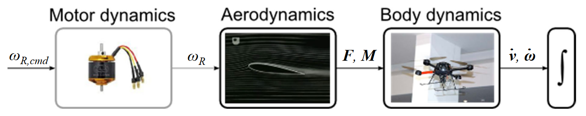

# Robotic Dynamics

---

Lecturer : Marco Hutter

---

## Kinematics

**position**

- *Cartesian coordinate* : $\boldsymbol \chi_{Pc}=\begin{bmatrix}x\\y\\z\end{bmatrix}, \bf r=\begin{bmatrix}x\\y\\z\end{bmatrix}$
- *Cylindrical coordinate* : $\boldsymbol \chi_{Pz}=\begin{bmatrix}\rho\\\theta\\z\end{bmatrix},_{\mathcal A}\bf r=\begin{bmatrix}\rho \cos \theta \\\rho \sin\theta\\z\end{bmatrix}$
- *Spherical coordinate* : $\boldsymbol \chi_{Ps}=\begin{bmatrix}r\\\theta\\\phi\end{bmatrix},_{\mathcal A}\bf r=\begin{bmatrix}r\cos\theta\sin\theta\\ r\sin\theta\sin\phi\\ r\cos\phi\end{bmatrix}$ 

**linear velocity** 
$$
\begin{aligned}
\dot {\bf r} &= \textbf E_P(\boldsymbol \chi_P)\dot {\boldsymbol \chi}_P
\\
\dot{\boldsymbol \chi}_P &= \textbf E_P^{-1}(\boldsymbol \chi_P)\dot {\textbf r}
\end{aligned}
$$

- *Cartesian coordinate* : $\textbf E_{Pc} =\textbf E_{Pc}^{-1}= \mathbb I$
- *Cylindrical coordinate* : $\textbf E_{Pz}=\begin{bmatrix}\cos\theta&-\rho\sin\theta&0\\\sin\theta&\rho\cos\theta &0\\0&0&1\end{bmatrix}$, $\textbf E_{Pz}^{-1} = \begin{bmatrix}\cos\theta&\sin\theta&0\\-\sin\theta/\rho&\cos\theta/\rho &0\\0&0&1\end{bmatrix}$ 
- *Spherical Coordinate* : $\textbf E_{Ps}=\begin{bmatrix}\cos\theta\sin\phi & -r\sin\phi\sin\theta & r\cos\phi\cos\theta\\\sin\phi\sin\theta & r\cos\theta\sin\phi & r\cos\phi \sin\theta\\ \cos\phi & 0 &  -r\sin\phi\end{bmatrix}$, $\textbf E_{Ps}^{-1}=\begin{bmatrix}\cos\theta\sin\phi & \sin\phi\sin\theta&\cos\phi\\-\sin\theta/(r\sin\phi)&\cos\theta/(r\sin\phi)&0\\(\cos\phi\cos\theta)/r&(\cos\phi\sin\theta)/r& -\sin\phi /r\end{bmatrix}$

**rotation**

- *Passive Rotation* : $_{\mathcal A}\textbf u = \textbf C_{\mathcal{AB}}\cdot_{\mathcal B}\textbf u$ ; *Active Rotation* : $_{\mathcal A}\textbf v=\textbf R\cdot _{\mathcal A}\textbf u$
- *Elementary Rotation* : $\textbf C_x(\varphi)=\begin{pmatrix}1&0&0\\0&\cos\varphi&-\sin\varphi\\0&\sin\varphi&\cos\varphi\end{pmatrix}$ , $\textbf C_y(\varphi) = \begin{pmatrix}\cos\varphi & 0 &\sin\varphi \\0&1&0\\-\sin\varphi&0&\cos\varphi\end{pmatrix}$ , $\textbf C_z(\varphi)=\begin{pmatrix}\cos\varphi&-\sin\varphi&0\\\sin\varphi&\cos\varphi&0\\0&0&1\end{pmatrix}$

- *Euler Angle*
  - *ZYZ Euler Angle* (yaw-pitch-yaw) : $\textbf C = \textbf C_{z_1}\textbf C_{y}\textbf C_{z_2}$ , $\boldsymbol \chi_{R,eulerZYZ}=\begin{pmatrix}\atan(c_{23}/c_{13})\\ \atan(\sqrt{c_{13}^2+c_{23}^2}/c_{33})\\\atan(c_{32}/(-c_{31}))\end{pmatrix}$
  - *ZXZ Euler Angle* (yaw-roll-yaw) : $\textbf C = \textbf C_{z_1}\textbf C_{x}\textbf C_{z_2}$ , $\boldsymbol \chi_{R,eulerZXZ}=\begin{pmatrix}\atan(c_{13}/(-c_{23}))\\ \atan(\sqrt{c_{13}^2+c_{23}^2}/c_{33})\\\atan(c_{31}/c_{32})\end{pmatrix}$
  - *ZYX Euler Angle* (yaw-pitch-roll) : $\textbf C = \textbf C_{z}\textbf C_{y}\textbf C_{x}$ , $\boldsymbol \chi_{R,eulerZYX}=\begin{pmatrix}\atan(c_{21}/c_{11})\\ \atan(-c_{31}/\sqrt{c_{32}^2+c_{33}^2})\\\atan(c_{32}/c_{33})\end{pmatrix}$
  - *XYZ Euler Angle* (roll-pitch-yaw) : $\textbf C = \textbf C_{x}\textbf C_{y}\textbf C_{z}$ , $\boldsymbol \chi_{R,eulerXYZ}=\begin{pmatrix}\atan(-c_{23}/c_{33})\\ \atan(c_{13}/\sqrt{c_{11}^2+c_{12}^2})\\\atan(-c_{12}/c_{11})\end{pmatrix}$
- *Angle  Axis* : $\boldsymbol \chi_{R,AngleAxis}=\begin{pmatrix}\theta\\\textbf n\end{pmatrix},\Vert \textbf n\Vert=1$
  - *Euler Vector*/ *Rotation Vector* : $\varphi = \theta\cdot \textbf  n\in \mathbb R^3$
  - $\textbf C_{\mathcal {AB}} = \begin{bmatrix}n_x^2(1-c_\theta)+c_\theta&n_xn_y(1-c_\theta)-n_zs_\theta&n_xn_z(1-c_\theta)+n_ys_\theta\\n_xn_y(1-c_\theta)+n_zs_\theta& n_y^2(1-c_\theta)+c_\theta & n_yn_z(1-c_\theta)-n_xs_\theta\\ n_xn_z(1-c_\theta)-n_ys_\theta&n_yn_z(1-c_\theta)+n_xs_\theta&n_z^2(1-c_\theta)+c_\theta\end{bmatrix}$
  - $\theta=\cos^{-1}\left(\frac{\text{Tr}(\textbf C)-1}{2}\right)$ , $\textbf n=\frac{1}{2\sin\theta}\begin{pmatrix}c_{32} - c_{23}\\c_{13}-c_{31}\\c_{21}-c_{12}\end{pmatrix}$
- *Unit Quaternions* : $\boldsymbol \chi_{R,quat}=\boldsymbol \xi=\begin{pmatrix}\xi_0\\\check {\boldsymbol \xi}\end{pmatrix}, \sum_{i=0}^3\xi_i^2=1$
  - $\xi_0 = \cos\left(\frac{\Vert \varphi\Vert}{2}\right)=\cos\left(\frac{\theta}{2}\right)$ , $\check{\boldsymbol \xi}=\sin\left(\frac{\Vert\varphi\Vert}{2}\right)\frac{\varphi}{\Vert\varphi\Vert} = \sin\left(\frac{\theta}{2}\right)\textbf n$
  - $\textbf C_{\mathcal {AD}} = \mathbb I + 2\xi_0\left[\check{\boldsymbol \xi}\right]_\cross + 2\left[\check{\boldsymbol\xi}\right]^2_{\cross} = (2\xi_0^2-1)\mathbb I+2\xi_0\left[\check{\boldsymbol \xi}\right]_\cross + 2\check {\boldsymbol \xi}\check{\boldsymbol \xi}^\top$ where $\left[\check {\boldsymbol \xi}\right]_\cross = \begin{bmatrix}0&-\xi_3&\xi_2\\\xi_3&0&-\xi_1\\-\xi_2&\xi_1&0\end{bmatrix}$
  - $\boldsymbol \xi = \frac{1}{2}\begin{pmatrix}\sqrt{\text{Tr}(\textbf C)+1}\\\text{sgn}(c_{32}-c_{23})\sqrt{c_{11}-c_{22}-c_{33}+1}\\\text{sgn}(c_{13}-c_{31})\sqrt{c_{22}-c_{33}-c_{11}+1}\\\text{sgn}(c_{21}-c_{12})\sqrt{c_{33}-c_{11}-c_{22}+1}\end{pmatrix}$
  - *Inverse* : $\boldsymbol \xi^{-1} = \boldsymbol \xi^\top=\begin{pmatrix}\xi_0\\-\check{\boldsymbol \xi}\end{pmatrix}$
  - *Multiplication* : $\boldsymbol \xi_{\mathcal{AC}} = \underbrace{\begin{bmatrix}\xi_0 & -\check{\boldsymbol \xi}^\top\\ \check{\boldsymbol \xi}&\xi_0\mathbb I+\left[\check {\boldsymbol \xi}\right]_\cross\end{bmatrix}}_{\textbf M_l(\boldsymbol \xi_{\mathcal AB})}\boldsymbol \xi_{\mathcal {BC}} = \underbrace{\begin{bmatrix}\xi_0 & -\check{\boldsymbol \xi}^\top\\\check{\boldsymbol \xi}&\xi_0\mathbb I-\left[\check {\boldsymbol \xi}\right]_\cross\end{bmatrix}}_{\textbf M_r(\boldsymbol \xi _{\mathcal BC})}\boldsymbol \xi_{\mathcal {AB}}$
  - *Vector Rotation* : $\begin{pmatrix}0\\_{\mathcal A}\textbf r\end{pmatrix} = \textbf M_l(\boldsymbol \xi_{\mathcal {AB}})\textbf M_r(\xi_{\mathcal {AB}}^\top)\begin{pmatrix}0\\_{\mathcal B }\textbf r\end{pmatrix}$
  - *Degree of Freedom* : 3

**angular velocity**
$$
_{\mathcal A}\omega_{\mathcal{AB}} = \textbf E_R(\boldsymbol \chi_R)\cdot \dot {\boldsymbol \chi}_R
$$

- *Transform* : $\left[_{\mathcal B}\omega_{\mathcal {AB}}\right]_\cross = \textbf C_{\mathcal {BA}}\cdot \left[_{\mathcal A}\omega_{\mathcal {AB}}\right]_\cross\cdot \textbf C_{\mathcal {AB}}$
- *Euler Angle*: $\textbf E_{R,euler \alpha\beta\gamma} = \begin{bmatrix}_{\mathcal A}\textbf e_A^{\mathcal \alpha}& _{\mathcal A}\textbf e_\beta^{\mathcal A'}& _{\mathcal A}\textbf e_\gamma^{\mathcal A''}\end{bmatrix}$
  - ZYZ : $\textbf E_{R,eulerZYZ} = \begin{bmatrix}0&-\sin z_1&\cos z_1\sin y\\0 & \cos z_1 & \sin z_1\sin y\\ 1 & 0 & 0\end{bmatrix}$ , $\textbf E^{-1}_{R,eulerZYZ} = \begin{bmatrix}-\cos y\cos z_1/\sin y & -\cos y \sin z_1/\sin y & 1\\ -\sin z_1 & \cos z_1 & 0\\ \cos z_1/\sin y & \sin z_1/ \sin y & 0\end{bmatrix}$
  - ZXZ : $\textbf E_{R,euler ZXZ}=\begin{bmatrix}0&\cos z_1&\sin z_1 \sin x\\ 0 & \sin z_1 & -\cos z_1 \sin x\\ 1 & 0 & \cos x\end{bmatrix}$ , $\textbf E^{-1}_{R,eulerZXZ} = \begin{bmatrix}-\cos x\sin z_1/\sin x & \cos  x\cos z_1/\sin x & 1\\ \cos z_1 & \sin z_1 & 0 \\ \sin z_1 /\sin x & -\cos z_1/ \sin x & 0\end{bmatrix}$
  - ZYX : $\textbf E_{R,eulerZYX} = \begin{bmatrix}0 & -\sin z & \cos y \cos z \\ 0 & \cos z & \cos y \sin z\\ 1 & 0 & -\sin y\end{bmatrix}$ , $\textbf E^{-1}_{R,eulerZYX} = \begin{bmatrix}\cos z \sin y /\cos y & \sin y \sin z /\cos y & 1\\ -\sin z & \cos z & 0 \\ \cos z / \cos y & \sin z /\cos y & 0\end{bmatrix}$
  - XYZ : $\textbf E_{R,eulerXYZ}=\begin{bmatrix}1 & 0 & \sin y \\ 0 & \cos x & -\cos y \sin x\\ 0 & \sin x & \cos x \cos y \end{bmatrix}$, $\textbf E^{-1}_{R,euler XYZ}=\begin{bmatrix}1&\sin x\sin y/\cos y & -\cos x\sin y /\cos y\\ 0 & \cos x & \sin x\\ 0 & -\sin x /\cos y & \cos x /\cos y\end{bmatrix}$
- *Angular Axis* : $\textbf E_{R,angleaxis}=\begin{bmatrix}\textbf n& \sin\theta\mathbb I+(1-\cos\theta)\left[\textbf n\right]_\cross\end{bmatrix}$ , $\textbf E_{R,angleaxis}^{-1}=\begin{bmatrix}\textbf n^\top\\ -\frac{1}{2}\frac{\sin\theta}{1-\cos\theta}\left[\textbf n\right]^2_\cross-\frac{1}{2}\left[\boldsymbol n \right]_\cross\end{bmatrix}$
- *Rotation Vector* : $\textbf E_{R,rotationvector}=\begin{bmatrix}\mathbb I+\left[\varphi\right]_\cross\left(\frac{1-\cos\Vert\varphi\Vert}{\Vert\varphi\Vert^2}\right)+\left[\varphi\right]_\cross^2\left(\frac{\Vert \varphi \Vert -\sin\Vert \varphi\Vert}{\Vert \varphi\Vert^3}\right)\end{bmatrix}$ , $\textbf E_{R,rotationvector}^{-1}=\left[\mathbb I -\frac{1}{2}\left[\varphi\right]_\cross +  \left[\varphi\right]^2_\cross\frac{1}{\Vert\varphi\Vert^2}\left(1-\frac{\Vert\varphi\Vert}{2}\frac{\sin\Vert\varphi\Vert}{1-\cos\Vert\varphi\Vert}\right)\right]$
- *Unit Quaternions* : $\textbf E_{R,quat}=2\textbf H(\boldsymbol \xi)$ , $\textbf E_{R,quat}^{-1}=\frac{1}{2}\textbf H(\boldsymbol \xi)^\top$,  with $\textbf H(\boldsymbol \xi) = \begin{bmatrix}-\check{\boldsymbol \xi}&\left[\check{\boldsymbol \xi}\right]_\cross + \xi_0 \mathbb I\end{bmatrix}\in \mathbb R^{3\times 4}$

**transformation** : $\textbf T_{\mathcal {AB}} = \begin{bmatrix}\textbf C_{\mathcal {AB}} & _{\mathcal A}\textbf r_{\mathcal{AB}}\\\textbf 0 & 1\end{bmatrix}$

- *Inverse* $\textbf T_{\mathcal {AB}}^\top = \begin{bmatrix}\textbf C^\top_{\mathcal{AB}} &\overbrace{-\textbf C_{\mathcal {AB}}^\top \textbf r_{\mathcal {AB}}}^{_{\mathcal B}\textbf r_{\mathcal {BA}}}\\ \textbf 0 & 1\end{bmatrix}$
- *Multiplication* : $\textbf T_{\mathcal {AC}}=\textbf T_{\mathcal {AB}} \textbf T_{\mathcal {BC}}$

**transformation acceleration**

- *Acceleration* : $\ddot {\textbf r}_{P} = \ddot{\textbf r}_{B} + \dot \omega_B\cross \textbf r_{BP } + \omega_B\times(\omega_B\cross \textbf r_{BP})$
- *Moving System* $\mathcal B$ : $_{\mathcal B}\dot{\textbf r}_{\mathcal {BP}} = _{\mathcal B}\dot{\textbf r_{\mathcal{AP}}} + _{\mathcal  B}\omega_{\mathcal {AB}}\times _{\mathcal B}\textbf r_{\mathcal {AP}}$

**task-space coordinate** 

- *End-Effector/Operational Space Coordinate* : $\boldsymbol \chi_e=\begin{pmatrix} \boldsymbol \chi_{e_P}\\ \boldsymbol \chi_{e_R}\end{pmatrix}$

**forward Kinematics**
$$
\textbf T_{\mathcal {IE}}(\textbf q) = \textbf T_{\mathcal{I}0}\cdot\prod_{k=1}^{n_j}\textbf T_{k-1,k}(q_k)\cdot \textbf T_{n_j\mathcal E}
$$
**differential Kinematics **: $\dot{\boldsymbol \chi}_e = \textbf J_{eA}(\textbf q)\dot {\textbf q}$ , $\ddot{\boldsymbol\chi}_e = \textbf J_{eA}(\textbf q)\ddot {\textbf q} + \dot{\textbf J}_{eA}(\textbf q)\dot{\textbf q}$

- *Analytical Jacobian* : $\textbf J_{eA}=\begin{bmatrix}\textbf J_{eA_P}\\\textbf J_{eA_R}\end{bmatrix}=\begin{bmatrix}\frac{\partial \boldsymbol \chi_{e_P}}{\partial \textbf q}\\ \frac{\partial \boldsymbol \chi _{e_R}}{\partial \textbf q}\end{bmatrix}\in \mathbb R^{m_e\times n_j}$

  - $\dot{\boldsymbol \chi}_e = \textbf J_{eA}(\textbf q)\dot {\textbf q}$

- *Geometric Jacobian* : $\textbf J_{e0}\in \mathbb R^{6\times n_j}$

  - $\textbf w_e = \textbf J_{e0}(\textbf q) \boldsymbol \omega$
  - Addition : $\textbf J_{c0} = \textbf {J}_{b0} +\textbf J_{bc0}$
  - from Analytical Jacobian : $\textbf J_{e0}(\textbf q)=\textbf E_e(\boldsymbol\chi)\textbf J_{eA}(\textbf q)$, where $\textbf E_e(\boldsymbol\chi)=\begin{bmatrix}\textbf E_P&\\&\textbf E_R\end{bmatrix}\in \mathbb R^{6\times m_e}$

- *Revolute Joint* : $_{\mathcal I}\textbf J_{e0}=\begin{bmatrix}_{\mathcal I}\textbf n_1\cross _{\mathcal I}\textbf r_{1(n+1)}&\cdots & _{\mathcal I}\textbf n_n\cross _{\mathcal I}\textbf  r_{n(n+1)}\\_{\mathcal I}\textbf n_1&\cdots & _{\mathcal I}\textbf n_n\end{bmatrix}$ 

- *Prismatic Joint* : $_{\mathcal I}\textbf J_{e0}=\begin{bmatrix}_{\mathcal I}\textbf n_1&\cdots & _{\mathcal I}\textbf n_n\\ \textbf 0 &\cdots &\textbf 0\end{bmatrix}$

- *Analytical  Jaocbian and Geometric Jacobian* :

  

**Inverse Differential  Kinematics** : $\dot {\textbf q} = \textbf J_{e0}^+\textbf w_e^*$ where $\textbf w_e^*$ is (desired) end-effector velocity

- full column rank $m\ge n $ : $A^+ = (A^\top A)^{-1}A^\top=\underset{A}{\text{argmin}}\Vert Ax-b\Vert_2^2$ 
- full row  rank $m\le n$ : $A^+ = A^\top (AA^\top)^{-1}$
- damped : $A^+_d = A^\top (AA^\top + \lambda ^2  \mathbb I)^{-1}=\underset{A}{\text{argmin}}\Vert Ax-b\Vert_2^2+\lambda^2 \Vert x\Vert_2^2$
- singularity : $\text{rank}(\textbf J_{e0})<6$
  - solution : 1. damped, 2. redundancy

**Multi-task Inverse Differential Kinematics** : $task_i =\{\textbf J_i, \textbf w_i^*\}$

- *Equal Priority* : $\dot {\textbf q} =\underbrace{\begin{bmatrix}\textbf J_1\\\vdots\\\textbf J_{n_t}\end{bmatrix}^+}_{\bar{\textbf J}^+ }\underbrace{\begin{pmatrix}\textbf w_1^*\\\vdots\\ \textbf w^*_{n_t}\end{pmatrix}}_{\bar{\textbf w}} = \underset{\dot  q}{\text{argmin}}\Vert \bar{\textbf J}\dot{\textbf q}-\bar{ \textbf  w}\Vert_2$
  - task weighted : $\bar{\textbf J}^{+W} = (\bar{\textbf J}^\top \textbf W\bar{\textbf J})^{-1}\bar{\textbf J}^\top \textbf W$ where $\textbf W=\text{diag}(w_1,\cdots,w_m)$
- *Prioritization* : $\dot {\textbf q} = \sum_{i=1}^{m}\bar{\textbf N}_{i-1}\dot {\textbf q}_i$ where $\dot {\textbf q}_i = (\textbf J_i\bar{\textbf N}_{i-1})^+\left(\textbf w_i^* - \textbf  J_i\sum_{k=1}^{i-1}\bar{\textbf N}_{k-1}\dot {\textbf q}_k\right)$ where $\bar{\textbf N}_i=\mathbb I - \textbf J_i^+\textbf J_i$ is the null space 
  - example $m=2$ : $\dot {\textbf q}=\textbf J_1^+\textbf w_1^* + \textbf N_1(\textbf J_2\textbf N_1)^+(\textbf w_2^* - \textbf J_2\textbf J_1^+\textbf w_1^*)$

**Inverse Kinematics** 

- *Numerical Solution* : 
  1. $\textbf q\gets \textbf q^0$
  2. while $\Vert \boldsymbol \chi _e^* - \boldsymbol \chi _e(\textbf q)\Vert>  \epsilon$ do 
     1. $\Delta \boldsymbol \chi_e\gets \boldsymbol \chi_e^*-\boldsymbol \chi_e(\textbf q)$ where $_{\mathcal I} \Delta \varphi = \text{rotVec}(\textbf C_{\mathcal{IB}}\textbf C_{\mathcal {IA}}^\top)$
     2. $\textbf  q\gets \textbf q + \alpha \textbf J_{eA}^+(\textbf q)\Delta \boldsymbol \chi_e$
- *Trajectory Control* 
  - Position : $\dot  q^* = \textbf  J^+_{e0_P}(\textbf q^t)\cdot (\dot{\textbf r}_e^*(t) + k_{p_P}\Delta \textbf r_e^t)$
  - Orientation : $\dot {\textbf q}^* = \textbf J_{e0_R}^+(\textbf q^t)\cdot (\omega_e^*(t)+k_{p_R}\Delta \varphi)$

**floating base kinematics**  $n_n=n_b+n_j$, $n_b$ un-actuated base coordinate + $n_j$ actuated joint coordinate

- *Generalized Velocity* : $\textbf  u =  \begin{pmatrix}_{\mathcal I}\textbf v_{ \mathcal B}\\_{\mathcal B}\boldsymbol \omega_{\mathcal {IB}}\\\dot \varphi_1\\\vdots \\ \dot\varphi_{n_j}\end{pmatrix} \in \mathbb R^{6+n_j}$ , where $\mathcal B$ is the floating base, $\mathcal  I$  is the inertial  frame

- *Forward Kinematics* : $_{\mathcal I}\textbf r_{\mathcal{IQ}}(\textbf q) = _{\mathcal I}\textbf r_{\mathcal {IB}}(\textbf q) + \textbf C_{\mathcal{IB}}(\textbf q)\cdot_{\mathcal B}\textbf r_{\mathcal{BQ}}(\textbf  q)$ where  $\textbf C_{\mathcal{IB}}$ describe the orientation of the floating base $\mathcal B$

- *Differential Kinematics*: $_{\mathcal I}\textbf J_Q(\textbf q) = \begin{bmatrix}_{\mathcal I}\textbf J_P \\ _{\mathcal I}\textbf J_R\end{bmatrix}= \begin{bmatrix}\mathbb I & -\textbf C_{\mathcal  {IB}}\cdot\left[_{\mathcal B}\textbf r_{BQ}\right]_\cross & \textbf C_{\mathcal{IB}}\cdot  _{\mathcal B}\textbf  J_{P_{q_j}}(\textbf q_j)\\\textbf 0 &  \textbf C_{\mathcal {IB}}& \textbf C_{\mathcal{IB}}\cdot _{\mathcal B}\textbf J_{R_{q_j}}(\textbf q_j)\end{bmatrix}$

- *Contact and Constraint* :   $\textbf r_c = \text{const}\quad\dot{\textbf r}=\ddot{\textbf  r}_c=0$  $\Leftrightarrow$ $_{\mathcal I}\textbf J_{C_i}\textbf u=\textbf 0\quad_{\mathcal I}\textbf J_{C_i}\dot {\textbf u}+_{\mathcal I}\dot{\textbf J}_{C_i}\textbf u  = \textbf 0$ , where $\textbf J_c\in \mathbb R^{3n_c\times n_n}$ , $n_c$ is the number of contacts

  

## Dynamics

**Generalized Equation of Motion**
$$
\textbf M(\textbf q)\ddot{\textbf q} + \textbf b(\textbf q,\dot{\textbf q})+\textbf g(\textbf q) = \textbf S^\top\tau + \textbf J_c(\textbf q)^\top \textbf F_c
$$

- $\textbf q,\dot{\textbf q},\ddot{\textbf q}\in \mathbb R^{n_q}$ : generalized position, velocity, acceleration
- $\textbf M(\textbf  q)\in \mathbb R^{n_q\times n_q}$ :  $\textbf M=\sum_{i=1}^{n_b}(_{\mathcal A}\textbf J_{S_i}^\top m_{\mathcal A}\textbf J_{S_i}+_{\mathcal B}\textbf J_{R_i}^\top~ _{\mathcal B}\Theta_{S_i} ~_{\mathcal B}\textbf  J_{R_i})$ generalized mass matrix
- $\textbf b(\textbf q,\dot{\textbf q})\in \mathbb R^{n_q}$  : $\textbf b=\sum_{i=1}^{n_b}\left(_{\mathcal A}\textbf J_{S_i}^\top m_{\mathcal A}\dot{\textbf J}_{S_i}\dot{\textbf q}+~_{\mathcal B}\textbf J_{R_i}^\top\left(_{\mathcal B}\Theta_{\mathcal B}\dot{\textbf J}_{R_i}\dot{\textbf q}+~_{\mathcal B}\boldsymbol\Omega_{S_i}\cross ~_{\mathcal B}\Theta_{S_i}~_{\mathcal B}\boldsymbol \Omega_{S_i}\right)\right)$ coriolis and centrifugal terms, where $\boldsymbol \Omega_{S_i} = \textbf J_{R_i}\dot{\textbf q}$
- $\textbf g(\textbf q)\in \mathbb R^{n_q}$ : $\textbf g=\sum_{i=1}^{n_b}-~_{\mathcal A}\textbf J_{S_i}^\top ~_{\mathcal A}\textbf F_{g,i}$ gravitational terms
  - Example : $\textbf g = \sum_i -\textbf J_i^\top m_i\begin{pmatrix}0\\0\\-9.81\end{pmatrix}$

- $\tau\in \mathbb R^{n_\tau}$ : generalized torques acting in direction of generalized coordinate $\tau = \sum_{k=1}^{n_A} \tau_{a,k}\tau_{ext}$ external generalized forces,
  - actuator generalized force $\tau_{a,k}=(\textbf J_{S_k} - \textbf J_{S_{k-1}})^\top\textbf  F_{a,k}+(\textbf J_{R_k}-\textbf J_{R_{k-1}})^\top \textbf  T_{a,k}$,  $\textbf T$ is torque here
  - external generalized force $\tau_{ext}=\sum_{j=1}^{n_{f,ext}}\textbf J_{P,j}^\top \textbf F_j+\sum_{j=1}^{n_{m,ext}}\textbf J_{R,j}^\top\textbf T_{ext, j}$
- $\textbf S\in \mathbb R^{n_\tau\times  n_q}$ : selection matrix of actuated joints
- $\textbf F_c\in \mathbb R^{n_c}$ : external Cartesian forces (e.g. from contacts)
  - *Soft Contact Model* : $\textbf F_c  = k_p(\textbf  r_c-\textbf r_{c0})+k_d\dot{\textbf r}_c$
  - *Contact Force from Constraint*  $\textbf r_c = \text{const}\quad\dot{\textbf r}=\ddot{\textbf  r}_c=0$ : $\textbf  F_c = (\textbf J_c\textbf M^{-1}\textbf J_c^\top)^{-1}\left(\textbf J_c\textbf M^{-1}(\textbf S^{\top}\tau-\textbf b-\textbf g)+\dot{\textbf J}_c\textbf u\right)$
- $\textbf J_c(\textbf q)\in \mathbb R^{n_c\times n_q}$ : Geometric Jacobian corresponding to external force
- *Kinect Energy* : $\mathcal T (\textbf q,\dot{\textbf q})=\frac{1}{2}\dot{\textbf  q}^\top\underbrace{\left(\sum_{i=1}^{n_b}(\textbf J_{S_i}^\top m\textbf J_{S_i}+\textbf J_{R_i}^\top \Theta_{S_i}\textbf J_{R_i})\right)}_{\textbf M(\textbf q)}\dot {\textbf q}$
- *Potential Energy* : $\mathcal U_g = -\sum_{i=1}^{n_b} \textbf r_{S_i}^\top \textbf F_{g_i}$

**Dynamics of Floating Base System**

- *Contact Force* 

  - Soft Contact : $\textbf F_c = k_p (\textbf r_c - \textbf  r_{c0}) + k_d \dot{\textbf r}_c$

  - Constraint Contact : $\textbf r_c = \text{const}$ $\dot{\textbf r}_c =\textbf J_c\textbf u = \textbf 0 $ $ \ddot{\textbf r}_c = \textbf J_c \dot{\textbf u}+\dot{\textbf J}_c\textbf u =  \textbf 0$

    $\textbf F_c = (\textbf J_c\textbf M^{-1}\textbf J_c^\top)^{-1}\left(\textbf J_c\textbf  M^{-1}(\textbf S^\top \tau -\textbf b-\textbf g) +  \dot{\textbf J}_c \textbf u\right)$

- *Constraint Consistent Dynamics* : 

  - $\textbf N_c = \mathbb I - \textbf M^{-1}\textbf J_c^\top (\textbf J_c \textbf M^{-1}\textbf J_c^\top)^{-1} \textbf J_c$
  - $\textbf  N_c^\top (\textbf  M\dot{\textbf u}+\textbf b+\textbf g) = \textbf  N_c^\top \textbf S^\top \tau$

- *Impulse Transfer* 

  - end-effector inertia : $\boldsymbol \Lambda_c  = (\textbf J_c\textbf M^{-1}\textbf J_c^\top)^{-1}$
  - instantaneous change : $\Delta u =\textbf  u^+-\textbf u^0= - \textbf M^{-1}\textbf J_c^\top (\textbf J_c\textbf M^{-1}\textbf J_c^\top)^{-1}\textbf J_c\textbf u^{-}$
  - post-impact generalized velocity : $\textbf u^+ = \textbf N_c \textbf u^{-1}$
  - Energy Loss : $E_{loss} = -\frac{1}{2}\Delta \textbf u^\top_c\boldsymbol \Lambda_c \Delta \textbf u$

  

**Joint Space Dynamic Control**

- *Gravity Compensation* : $\tau^* = k_p(\textbf q^* - \textbf q) + k_d(\dot{\textbf q}^*-\dot{\textbf q})+\textbf g(\textbf q)$
- *Inverse Dynamics Control* : $\ddot{\textbf q}^* = k_p(\textbf q^*-\textbf q)+k_d(\dot{\textbf q}^*-\dot{\textbf q})$ , $\omega=\sqrt{k_p},D=\frac{k_d}{2\sqrt{k_p}}$

**Task Space Dynamic Control** : $\dot {\textbf w}_e = \begin{pmatrix}\ddot{\textbf r}\\\dot{\boldsymbol \omega}\end{pmatrix}=\textbf J_e\ddot{\textbf q} + \dot{\textbf J}_e\dot{\textbf q}$

- *Multi-task Decomposition* :
  - Equal Priority :  $\ddot {\textbf q} =\begin{bmatrix}\textbf J_1\\\vdots\\\textbf J_{n_t}\end{bmatrix}^+\left(\begin{pmatrix}\dot{\textbf w_1}^*\\\vdots\\ \dot{\textbf w^*_{n_t}}\end{pmatrix} - \begin{bmatrix}\dot{\textbf J}_1\\\vdots\\\dot{\textbf J}_{n_t}\end{bmatrix}\dot{\textbf q}\right)$
  - *Prioritization* : $\ddot {\textbf q} = \sum_{i=1}^{n_t}\textbf N_{i}\ddot {\textbf q}_i$ where $\ddot {\textbf q}_i = (\textbf J_i\textbf N_{i})^+\left(\dot{\textbf w_i}^* - \dot{\textbf  J}_i\dot{\textbf q}-\textbf J_i\sum_{k=1}^{i-1}\textbf N_k\ddot {\textbf q}_k\right)$ where $\textbf N_i=\mathbb I - \textbf J_i^+\textbf J_i$ is the null space 
  
- *End-effector Dynamics*  : $\Lambda _e \dot{\textbf w}_e + \boldsymbol \mu + \textbf p=\textbf F_e$ 
  - $\Lambda_e = (\textbf J_e\textbf M^{-1}\textbf J_e^\top)^{-1}$ : end-effector inertia
  - $\boldsymbol \mu = \Lambda_e\textbf J_e\textbf M^{-1}\textbf b - \Lambda_e \dot{\textbf J}_e\dot{\textbf q}$ : end-effector centrifugal/Coriolis
  - $\textbf p = \Lambda_e \textbf J_e\textbf M^{-1}\textbf g$ : end-effector  gravitational
  - joint torque $\tau = \textbf J_e^\top \textbf F_e$
  
- *End-effector Motion Control* : $\tau^* = \textbf J^\top(\Lambda_e\dot{\textbf w}_e^*+\boldsymbol \mu + \textbf p)=\textbf J^\top \Lambda_e\dot{\textbf w}_e^*+\textbf b-\textbf  J^\top \Lambda_e\dot{\textbf J}_e\dot{\textbf q}+\textbf g$

- *Operational Space Control* : $\tau^*=\textbf J^\top(\Lambda \textbf S_M\dot{\textbf w}_e + \textbf S_F\textbf F_c + \boldsymbol \mu +\textbf p)$
  
  - $\Sigma_p =\begin{bmatrix}\sigma_{px}&0&0\\0&\sigma_{py}&0\\0&0&\sigma_{pz}\end{bmatrix}$ , $\Sigma_r = \begin{bmatrix}\sigma_{rx}&0&0\\0&\sigma_{ry}&0\\0&0&\sigma_{rz}\end{bmatrix}$ where $\sigma_i=1$ if the axis is free of  motion, otherwise $0$
  
  - $\textbf S_M=\begin{bmatrix}\textbf C^\top \Sigma_p\textbf C&0\\0&\textbf C^\top \Sigma_r \textbf C\end{bmatrix}$ , $\textbf  S_F=\begin{bmatrix}\textbf C^\top (\mathbb I -\Sigma_p)\textbf C&0 \\ 0& \textbf C^\top (\mathbb I-\Sigma_r)\textbf C\end{bmatrix}$ 
  
    

**Inverse Dynamics for Floating-Base Systems**

- *Hierarchical Least  Square Optimization* : $\underset{\textbf x}{\text{min}}\Vert \textbf A_i\textbf x - \textbf b_i\Vert_2$ with priority

  normally $\textbf x = \begin{bmatrix}\ddot {\textbf q}^\top &\boldsymbol\tau^\top & _{\mathcal I}\textbf F_E^\top\end{bmatrix}^\top$
  
  1. $n_T$ : number of tasks
  2. $\textbf x=\textbf  0$ : initial optimal solution
  3. $\textbf N_1 = \mathbb I$ : initial null-space projector
  4. for $i=1\to n_T$ do 
     1. $\textbf  x_i\gets (\textbf A_i\textbf N_i)^+(\textbf b_i-\textbf A_i\textbf  x)$
     2. $\textbf x\gets \textbf x +  \textbf N_i\textbf x_i$
     3. $\textbf N_{i+1}=\mathcal N\left(\left[\textbf A_1^\top\cdots\textbf A_i^\top\right]^\top\right)$ : null-space, normally $\mathcal N(\textbf A)=\mathbb I-\textbf A^+ \textbf A$ , $\mathcal N(\textbf A)\textbf A = \textbf 0$
  

## Legged Robot

**Input** : $\textbf q,\dot{\textbf q}$

**Optimization Target** : $\ddot {\textbf q}, \textbf F_c, \boldsymbol \tau$

**Tasks** :

1. Equation of Motion : $\begin{bmatrix}\textbf M(\textbf q)&-\textbf J_c&-\textbf S^\top\end{bmatrix}\begin{bmatrix}\ddot {\textbf q}\\\textbf F_c\\\boldsymbol \tau \end{bmatrix} = - \textbf b(\dot{\textbf q},\textbf q)-\textbf g(\textbf q)$
2. End Effector Desired Velocity $\textbf w^*_e$: $\begin{bmatrix}\textbf J_e&\textbf 0 &\textbf 0\end{bmatrix}\begin{bmatrix}\ddot {\textbf q}\\\textbf F_c\\\boldsymbol \tau \end{bmatrix} = \dot{\textbf w}_e -\dot{\textbf J}_c \dot{\textbf q}$ where $\dot {\textbf w}_e = k_p(\textbf r_e^*-\textbf r_e)-k_d(\textbf  w_e^*-\textbf w_e)$
3. *Torque minimize* : $\begin{bmatrix}\textbf 0&\textbf 0&\mathbb I\end{bmatrix}\begin{bmatrix}\ddot {\textbf q}\\\textbf F_c\\\boldsymbol \tau \end{bmatrix} = \textbf 0$
4. *Torque limits* : $\begin{bmatrix}\textbf 0&\textbf 0&\mathbb I\end{bmatrix}\begin{bmatrix}\ddot {\textbf q}\\\textbf F_c\\\boldsymbol \tau \end{bmatrix} \le \textbf 1 \cdot\tau_{max}$ and $\begin{bmatrix}\textbf 0&\textbf 0&-\mathbb I\end{bmatrix}\begin{bmatrix}\ddot {\textbf q}\\\textbf F_c\\\boldsymbol \tau \end{bmatrix} \le -\textbf 1 \cdot\tau_{max}$
5. *Contact Force minimize* : $$\begin{bmatrix}\textbf 0&\mathbb I & \textbf 0\end{bmatrix}\begin{bmatrix}\ddot {\textbf q}\\\textbf F_c\\\boldsymbol \tau \end{bmatrix} = \textbf 0$$
6. *Friction Cone* : $\begin{bmatrix}\textbf 0&\begin{matrix}\begin{bmatrix}0&-1\\1-\mu & -1-\mu\end{bmatrix}&\textbf 0\\ \textbf 0 & \begin{bmatrix}0&-1\\1-\mu & -1-\mu\end{bmatrix}\end{matrix} & \textbf 0\end{bmatrix}\begin{bmatrix}\ddot {\textbf q}\\\textbf F_c\\\boldsymbol \tau \end{bmatrix} \le \textbf 0$ for $2D$ $x-z$ problem

**Optimization** 

*[HO]Hierarchical Least  Square Optimization* 

## Rotorcrafts

$$
\underbrace{\begin{bmatrix}m\mathbb I &  0 \\ 0 & \boldsymbol\Theta\end{bmatrix}}_{\textbf M}\underbrace{\begin{bmatrix}\dot{\boldsymbol \nu} \\ \dot{\boldsymbol \omega}\end{bmatrix}}_{\ddot{\textbf q}} + \underbrace{\begin{bmatrix}\boldsymbol \omega \times m \boldsymbol \nu \\ \boldsymbol \omega\times \boldsymbol \Theta\boldsymbol \omega\end{bmatrix}}_{\textbf b} = \underbrace{\begin{bmatrix}\textbf F\\\underbrace{ M}_{\text{torque}}\end{bmatrix}}_{\boldsymbol \tau}
$$

$$
_{\mathcal B}\textbf F= \underbrace{\textbf  C_{\mathcal{IB}}^\top ~_{\mathcal I}\begin{bmatrix}0\\0\\mg\end{bmatrix}}_{_{\mathcal B}\textbf F_G} + \underbrace{\sum_{i=1}^4 ~_{\mathcal B}\begin{bmatrix}0\\0\\-T_i\end{bmatrix}}_{_{\mathcal B}\textbf F_{Aero}}
$$

$$
_{\mathcal B}M = \underbrace{_{\mathcal B}\begin{bmatrix}l(T_4-T_2)\\l(T_1-T_3)\\0\end{bmatrix}}_{_{\mathcal B}M_T}+ \underbrace{_{\mathcal B}\begin{bmatrix}0\\0\\ \sum_{i=1}^4 Q_i(-1)^i\end{bmatrix}}_{_{\mathcal B} Q}
$$

- $T_i$ : Thrust force for propeller $i$ , $T_i = b\omega_{p,i}^2$ generate lift for keeping the rotorcraft in the air 
- $Q_i$ : Drag force of propeller $i$ , $Q_i=d\omega_{p,i}^2$ rotor drag
- $_{\mathcal B}M_T$ : Thrust  Induced moment, $M_T = \begin{bmatrix}-\sin\theta\\\sin\phi\cos\theta\\\cos\phi \cos\theta\end{bmatrix}mg$
- $_{\mathcal B}Q$ : Drag torques/moment
- $\textbf C_{\mathcal {IB}}$ : transition from earth frame to body frame , 
- $_{\mathcal B}\boldsymbol \omega$ : Body Angular Velocity $_{\mathcal B}\boldsymbol \omega =_{\mathcal B} \begin{bmatrix}p\\q\\r\end{bmatrix}=\begin{bmatrix}\dot \phi\\\dot \theta\\\dot \psi\end{bmatrix}$
- $\omega_{p,i }$ : Rotational Speed of Propeller $i$
- $_{\mathcal B}\boldsymbol \nu$ : Basis Translation Velocity $_{\mathcal B}\boldsymbol \nu = _{\mathcal B}\begin{bmatrix}u\\v\\w\end{bmatrix} = _{\mathcal B}\begin{bmatrix}\dot x\\\dot y \\\dot z\end{bmatrix}$
- $l$ : Distance of the propeller from the central of gravity

**Control of Quadrotor** 
$$
\begin{array}{lr}
\boldsymbol \Theta_{xx}\dot p = q\cdot r(\boldsymbol \Theta_{yy}-\boldsymbol \Theta_{zz}) + U_2 & (1)
\\

\boldsymbol \Theta_{yy}\dot q = r\cdot p(\boldsymbol \Theta_{zz}-\boldsymbol \Theta_{xx}) + U_3 & (2)
\\

\boldsymbol \Theta_{zz}\dot r = U_4 & (3)
\\

m\dot u = m(r\cdot v - q\cdot w )- \sin\theta~ mg & (4)
\\
m\dot v = m(p\cdot w - r\cdot u ) + \sin \phi \cos \theta ~ mg & (5)
\\
m\dot w = m(q\cdot u - p\cdot v) + \cos \phi \cos \theta ~  mg - U_1 & (6)
\end{array}
$$

$$
\begin{bmatrix}U_1\\U_2\\U_3\\U_4\end{bmatrix}=
\underbrace{\begin{bmatrix}b&b&b&b\\
0&-lb&0&lb\\
lb&0&-lb&0\\
-d&d&-d&d\end{bmatrix}}_{\textbf A}
\begin{bmatrix}\omega_{p,1}^2\\\omega_{p,2}^2\\\omega_{p,3}^2\\\omega_{p,4}^2\end{bmatrix}
$$

- *Equilibrium* : $_{\mathcal B}\boldsymbol \nu = \phi = \theta=\textbf 0$

  - $_{\mathcal B} \dot{\boldsymbol \omega} = \boldsymbol \Theta^{-1}\begin{bmatrix}U_2&U_3&U_4\end{bmatrix}^\top$

  - $$
    \begin{array}{l}
    U_1 = T^*
    \\
    U_2 = (\phi^* - \phi)k_{p,roll}-\dot\phi k_{d,roll}
    \\
    U_3 = (\theta^* - \theta)k_{p,pitch}-\dot\theta k_{d,pitch}
    \\
    U_4 = (\psi^*  - \psi)k_{p,yaw} - \dot \psi k_{d,yaw}
    \end{array}
    $$

- *Altitude Control* $x=y=u=v=0$

  - $\dot w = g- \frac{1}{m}\underbrace{\cos\phi\cos\theta ~U_1}_{T_z} $
  - $T_z = -k_p(z^*-z)+k_d\dot z - mg$

- *Position Control* 

  - $_{\mathcal B}{\dot {\boldsymbol \nu}} = \frac{1}{m}\begin{bmatrix}T_x&T_y&T_z\end{bmatrix}^\top + \begin{bmatrix}0&0&g\end{bmatrix}^\top$

**Hexacopter**

$$
\textbf A = \begin{pmatrix}b&b&b&b&b&b\\ bls_{30} & bl & bls_{30}& -bls_{30} & -bl & -bl s_{30}\\ -bl c_{30} & 0 & blc_{30} & blc_{30} & 0 & -blc_{30} \\ d& -d & d & -d & d & -d\end{pmatrix}
$$

**MAV Control** 

1. $_{\mathcal B}\boldsymbol \omega_{ref} = \text{PID}(_{\mathcal B}\boldsymbol \nu_{ref},_{\mathcal B}\boldsymbol \nu)$
2. $U_1 = mg\\ \begin{bmatrix}U_2,U_3,U_4\end{bmatrix}^\top=\text{PID}(_{\mathcal B}\boldsymbol \omega_{ref},~_{\mathcal B}\boldsymbol \omega,~_{\mathcal B}\dot{\boldsymbol \omega})$
3. $\omega_p^2 = \textbf A^+ \begin{bmatrix}U_1&U_2&U_3&U_4\end{bmatrix}^\top$

**Propeller Aerodynamics** 

- $u_1 = u_2$ : no change of  speed across rotor/propeller disc
- $\rho A_0 V = \rho A_R(V+u_1) = \rho A_R(V+u_2)=\rho A_3 u_3$ : change in pressure
-  $u_3 = 2u_1$ : far wake slipstream velocity is twice the induced velocity 
- $F_{\text{Thrust}} = \rho A_R(V+u_1)u_1$ 
- $P_{\text{Thrust}} = \frac{1}{2}\rho A_R(V+u_1)(2V + u_3) u_3$
- *Hover case* : $P = \frac{F^{3/2}_{\text{Thrust}}}{\sqrt{2\rho A_R}} = \frac{(mg)^{3/2}}{\sqrt{2\rho A_R}}$

- $T$ : Thrust force
  - Aerodynamic force perpendicular to propeller plane
  - $|T|=\frac{\rho}{2}A_PC_T(\omega_PR_P)^2$ 
- $Q$ : Drag torque
  - torque around rotor plane in the opposite direction of the propeller  spinning direction
  - $|Q| =\frac{\rho}{2}A_PC_Q(\omega_PR_P)^2  R_P$
  - $C_T$ , $C_Q$ depend on blade pitch angle, reynolds number ...
- $H$ : hub force 
  - opposite to horizontal flight direction $V_H$ 
  - $|H| = \frac{\rho}{2}A_PC_H(\omega_PR_P)^2$
- $R$ : Rolling moment
  - around flight direction
  - $|R| = \frac{\rho}{2}A_PC_R(\omega_PR_P)^2R_P$
  - $C_H$ ,$C_R$ depend on the advance ratio $\mu = \frac{V}{\omega_PR_P}$

**[BEMT]Blade Elemental and Momentum Theory** : calculate forces for each element and sum them up

## Fixed-Wing

- Ailerons (rolling)
- Elevator (pitching)
- Rudder (yawing)

- $\alpha$ : angle of attach $\atan(w/u)$
  - *stall* : $\begin{cases}\alpha\uparrow \to c_L\uparrow & \alpha <\text{stall} \\ \alpha^\uparrow  \to c_L\downarrow & \alpha > \text{stall}\end{cases}$ stall is not safe
- $\beta$ : sideslip angle $\beta = \asin(v/V)$ 
- $\theta$ : pitch angle 
- $\phi$ : roll angle , rotate about $x$-axis
- $\psi$ : yaw angle
- $\gamma$ :  flight path angle, defined from horizon to $\textbf v_a$
- $\xi$ : heading angle, defined from North to $\textbf v_a$
- $\textbf v_w$ : wind velocity 
- $\textbf v$ : ground-based inertial velocity
- $L$ : Lift $L=\frac{1}{2}\rho V^2 S{c_L}(\alpha)$ ,where $S$ is the surface area
- $D$ : Drag $D=\frac{1}{2}\rho V^2 S{c_D}$, perpendicular to Lift, parallel to air velocity $\textbf v_a$
  - minimum fuel for straight : $\underset{\alpha}{\text{max}}\frac{c_L(\alpha)}{c_D(\alpha)}$
  - minimum fuel for circle : $\underset{\alpha}{\text{max}}\frac{c_L(\alpha)^3}{c_D(\alpha)^2}$
- $L_m$ : rolling moment $L_m = \frac{1}{2}\rho V^2 S{bc_l}$ , where $b$ is the wing span
- $M_m$ : pitching moment $M_m = \frac{1}{2}\rho V^2 S{\bar cc_m}$, where $c$ is the chord, 
- $N_m$ : yawing moment $N_m = \frac{1}{2}\rho V^2 S{bc_n}$

**Steady Level Turning Flight** 

- steady : $_{\mathcal B}\dot{\textbf v}_a = ~_{\mathcal B}\dot{\omega}=0$
- level : $\gamma = 0$
- turning : $\phi = \text{const}$ :

$$
\begin{array}{l}
L\cos\phi = mg 
\\
L\sin \phi = m\frac{V^2}{R} = mR\dot\xi
\\
D=T
\end{array}
\quad 
\rightarrow 
\quad
\begin{array}{l}
\dot{\xi}  = \frac{g\tan\phi}{V}
\\
L\propto \frac{1}{\cos\phi}
\\
V\propto \sqrt{\frac{1}{\cos\phi}}
\end{array}
$$
**$\mathcal L_1$ Guidance**

$$
\begin{array}{l}
a_s = \frac{V^2}{R}  = 2\frac{V^2 \sin\eta}{L_1}
\\
\dot\phi \approx \dot\xi= \phi_d = \atan\left(\frac{a_s}{g}\right)
\end{array}
$$
**Total Energy Control System** 

- $\dot E_{spec} = \frac{\dot E_{tot}}{mgV}=\frac{\dot V}{g}+\sin\gamma\approx \frac{\dot V}{g}+\gamma$
- $\dot E_{dist} = \gamma - \frac{\dot V}{g}$

**Modeling for Control (Linearized Plant)**

- *Longitudinal Plant* 

  input : $\Delta \delta_e, \Delta\delta_T$

  output : $\Delta u, \Delta w, \Delta q,\Delta\theta$

  - Short Period Mode $\mathbb C$ : $\omega=5\text{rad}/s$ 

    

    exchange between kinetic and potential energy: slow

  - Phugoid Mode $\mathbb C$ : $\omega = 0.6~\text{rad}/s$

    

    oscillation of angle of attack : fast

- *Lateral Plant* 

  input : $\Delta \delta_a, \Delta \delta_r$

  output : $\Delta v,\Delta p, \Delta r, \Delta\phi,\Delta\psi$

  - Spiral Mode $\mathbb R$: unstable

    

  - Dutch Roll Mode $\mathbb C$ : $\omega = 5\text{rad}/s$

    

  - Roll Subsidence $\mathbb R$

## Statements

**Kinematics**

- $\cross$ : A homogeneous transformation $T_{\mathcal {AB}}$ from frame $\mathcal B$ to $\mathcal A$ applied to a
  vector only changes its representation but not the underlying $v$ 
- $\checkmark$ : A rotation matrix $C_{\mathcal {AB}}$ between from frame $\mathcal B$ to $\mathcal A$ applied to a vector
  only changes its representation but not the underlying $v$ 
- $\cross$ : A planar two-link robot arm has a unique solution to the inverse kinematic
  problem
- $\cross$ : For a planar two-link robot arm, the differential inverse kinematic algorithm always converges to the same solution irrespective of initial configuration
-  $\cross$ :  floating base in 3-dimensional space there exists a choice of generalized coordinates such that the analytical and geometric orientation
  Jacobian are equal

**Dynamics**

- $\cross$ : Given a perfect model, a robotic arm controlled by a PD controller with gravity compensation can achieve zero tracking error for any desired trajectory.
- $\cross$ : When choosing a unit quaternion as part of the generalized coordinates
  of a free-floating rigid body in 3D space, the mass matrix must have dimensions $7\times 7$  

**Legged Robot**

- $\checkmark$ : For a bipedal system with two point feet on the ground, every torque
  command results in a unique acceleration 
- $\cross$ : For a bipedal system with two point feet on the ground, every constraint
  consistent acceleration $\dot u^∗_{consistent}$ is achieved by a unique torque command 

**Rotor Craft**

- $\cross$ : A classic hexacopter (multi-rotor with 6 propellers) with all propellers
  spinning in the same plane is a fully actuated platform
- $\checkmark$ : The yaw motion for a quadcopter is controlled by the drag moment of the
  propeller 
- $\cross$ : The attitude dynamics of a quadcopter can be stabilized by a proportional
  controller only
- $\cross$ : The hub force on a rotor in froward flight results mostly  due to  an imbalance of the lift  forces on the advancing and the retreating blade.
- $\checkmark$ : BEMT can be used to model propeller characteristics, where momentum theory enables solving for induced velocities.
- $\cross$ : A swashplate has generally three degree  of  freedom . One to control the cyclic pitch and two to control the collective pitch.
- $\cross$ : A rotor in forward motion  has a reverse flow region on the advancing blade
- $\cross$ : In a front-rear rotor configuration, the yaw motion is steered by differential drag torques of the rotors.
- $\checkmark$ : According to the momentum theory, the power consumption decrease to zero  by increasing  the disc area to infinity

**Fixed Wing**

- $\cross$ : The magnitude of the GPS velocity can be used directly as an airspeed
  measurement
- $\cross$ : The heading of a conventional aircraft is controlled primarily by the rudder 
- $\checkmark$ : Wind disturbances are typically modeled/mitigated within the guidance-
  level loops of a fixed-wing autopilot 
- $\checkmark$ : Minimum airspeed demand during a coordinated turn increases as the
  turning radius decreases, assuming constant angle of attach 
- $\cross$ : in a coordinate turn, the sideslip force causes the needed centripetal acceleration
